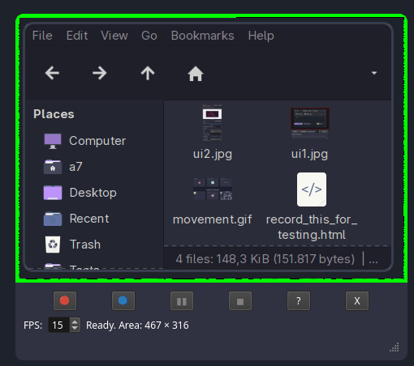
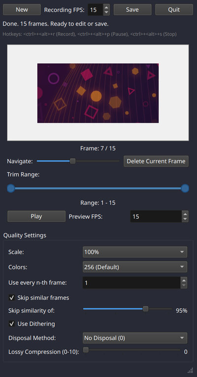
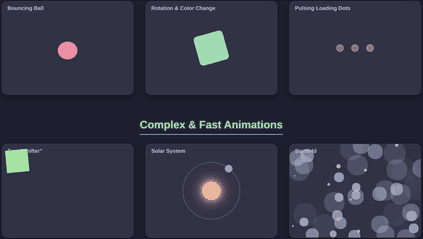

# Square Linux Gif Recorder 

A linux desktop application for recording GIFs, with a lot of quality settings.
Please leave a ⭐ and pleas give feedback, i tested this on archlinux currently and I will support more linux distributions (In case it is not working on your distribution).

### UI Screenshot
 


### Movement GIF


## Features

*   **Screen Recording**: Capture a specific area of your screen to create GIFs.
*   **Recording Timer**: Control the duration of your GIF recordings.
*   **Live Preview**: See a live preview of your recording area.
*   **Quality Setting**: Easily save your recorded GIFs to a specified location.

## Quality Settings

The application provides a range of settings to control the quality and file size of your GIFs:

*   **FPS (Frames Per Second)**: Controls the playback speed of the GIF. Higher values result in smoother animations but larger file sizes.
*   **Scale Factor**: Resizes the GIF frames. A value of 1.0 means original size, while smaller values (e.g., 0.5) reduce dimensions and file size.
*   **Number of Colors**: Determines the size of the color palette used in the GIF (2-256 colors). Fewer colors reduce file size but may impact visual fidelity.
*   **Use Dithering**: Applies dithering to smooth color transitions when reducing the number of colors. Can improve visual quality but might slightly increase file size.
*   **Skip Value**: Skips frames during recording. A value of 1 means all frames are captured, 2 means every second frame is skipped, and so on. Useful for reducing file size for longer recordings.
*   **Similarity Threshold**: (Advanced) A value between 0.0 and 1.0 that determines how similar two consecutive frames must be to be considered identical. Frames above this threshold can be skipped.
*   **Enable Similarity Skip**: When enabled, the application automatically skips frames that are very similar to the previous one, significantly reducing file size for static or slow-moving content (between 40% and 70% for desktop recordings).
*   **Mouse Skip**: Reduces mouse cursor updates in the recording. A value of 0 updates the cursor every frame, 1 updates every 2nd frame, 2 every 3rd frame, etc. This creates a "stuttering" cursor effect that can significantly reduce file size by 5%-10% with Similarity Skip.
*   **Lossy Level**: Applies additional compression (0-10). Higher values result in smaller file sizes but may introduce more artifacts.
*   **Disposal Method**: Controls how previous frames are handled when a new frame is displayed (0-3). Affects transparency and animation smoothness.


## Installation
[Download](https://github.com/spinalcord/Square-Gif-Recorder/releases/tag/Release) the executable:

Allow execution and run
```
chmod +x recorder
./recorder
```

Optional: clone the repository install dependencies and do `python main.py`